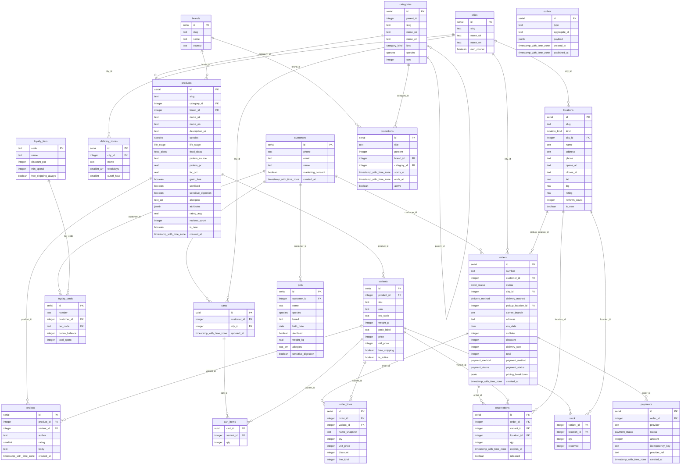

# ER-модель PetShop Platform

Згенеровано автоматично з `migrations/meta/snapshot.json` (Drizzle). Таблиць: 21.

```mermaid
erDiagram
  brands {
    serial id PK
    text slug
    text name
    text country
  }
  cart_items {
    uuid cart_id PK
    integer variant_id PK
    integer qty
  }
  carts {
    uuid id PK
    integer customer_id FK
    integer city_id FK
    timestamp_with_time_zone updated_at
  }
  categories {
    serial id PK
    integer parent_id
    text slug
    text name_uk
    text name_en
    category_kind kind
    species species
    integer sort
  }
  cities {
    serial id PK
    text slug
    text name_uk
    text name_en
    boolean own_courier
  }
  customers {
    serial id PK
    text phone
    text email
    text name
    boolean marketing_consent
    timestamp_with_time_zone created_at
  }
  delivery_zones {
    serial id PK
    integer city_id FK
    text name
    smallint_arr weekdays
    smallint cutoff_hour
  }
  locations {
    serial id PK
    text slug
    location_kind kind
    integer city_id FK
    text name
    text address
    text phone
    text opens_at
    text closes_at
    real lat
    real lng
    real rating
    integer reviews_count
    boolean is_new
  }
  loyalty_cards {
    serial id PK
    text number
    integer customer_id FK
    text tier_code FK
    integer bonus_balance
    integer total_spent
  }
  loyalty_tiers {
    text code PK
    text name
    integer discount_pct
    integer min_spend
    boolean free_shipping_always
  }
  order_lines {
    serial id PK
    integer order_id FK
    integer variant_id FK
    text name_snapshot
    integer qty
    integer unit_price
    integer discount
    integer line_total
  }
  orders {
    serial id PK
    text number
    integer customer_id FK
    order_status status
    integer city_id FK
    delivery_method delivery_method
    integer pickup_location_id FK
    text carrier_branch
    text address
    date eta_date
    integer subtotal
    integer discount
    integer delivery_cost
    integer total
    payment_method payment_method
    payment_status payment_status
    jsonb pricing_breakdown
    timestamp_with_time_zone created_at
  }
  outbox {
    serial id PK
    text type
    text aggregate_id
    jsonb payload
    timestamp_with_time_zone created_at
    timestamp_with_time_zone published_at
  }
  payments {
    serial id PK
    integer order_id FK
    text provider
    payment_status status
    integer amount
    text idempotency_key
    text provider_ref
    timestamp_with_time_zone created_at
  }
  pets {
    serial id PK
    integer customer_id FK
    text name
    species species
    text breed
    date birth_date
    boolean sterilised
    real weight_kg
    text_arr allergies
    boolean sensitive_digestion
  }
  products {
    serial id PK
    text slug
    integer category_id FK
    integer brand_id FK
    text name_uk
    text name_en
    text description_uk
    species species
    life_stage life_stage
    food_class food_class
    text protein_source
    real protein_pct
    real fat_pct
    boolean grain_free
    boolean sterilised
    boolean sensitive_digestion
    text_arr allergens
    jsonb attributes
    real rating_avg
    integer reviews_count
    boolean is_new
    timestamp_with_time_zone created_at
  }
  promotions {
    serial id PK
    text title
    integer percent
    integer brand_id FK
    integer category_id FK
    timestamp_with_time_zone starts_at
    timestamp_with_time_zone ends_at
    boolean active
  }
  reservations {
    serial id PK
    integer order_id FK
    integer variant_id FK
    integer location_id FK
    integer qty
    timestamp_with_time_zone expires_at
    boolean released
  }
  reviews {
    serial id PK
    integer product_id FK
    integer variant_id FK
    text author
    smallint rating
    text body
    timestamp_with_time_zone created_at
  }
  stock {
    integer variant_id PK
    integer location_id PK
    integer qty
    integer reserved
  }
  variants {
    serial id PK
    integer product_id FK
    text sku
    text ean
    text erp_code
    integer weight_g
    text pack_label
    integer price
    integer old_price
    boolean free_shipping
    boolean is_active
  }
  carts ||--o{ cart_items : cart_id
  variants ||--o{ cart_items : variant_id
  customers ||--o{ carts : customer_id
  cities ||--o{ carts : city_id
  cities ||--o{ delivery_zones : city_id
  cities ||--o{ locations : city_id
  customers ||--o{ loyalty_cards : customer_id
  loyalty_tiers ||--o{ loyalty_cards : tier_code
  orders ||--o{ order_lines : order_id
  variants ||--o{ order_lines : variant_id
  customers ||--o{ orders : customer_id
  cities ||--o{ orders : city_id
  locations ||--o{ orders : pickup_location_id
  orders ||--o{ payments : order_id
  customers ||--o{ pets : customer_id
  categories ||--o{ products : category_id
  brands ||--o{ products : brand_id
  brands ||--o{ promotions : brand_id
  categories ||--o{ promotions : category_id
  orders ||--o{ reservations : order_id
  variants ||--o{ reservations : variant_id
  locations ||--o{ reservations : location_id
  products ||--o{ reviews : product_id
  variants ||--o{ reviews : variant_id
  variants ||--o{ stock : variant_id
  locations ||--o{ stock : location_id
  products ||--o{ variants : product_id
  categories ||--o{ categories : parent_id
```
